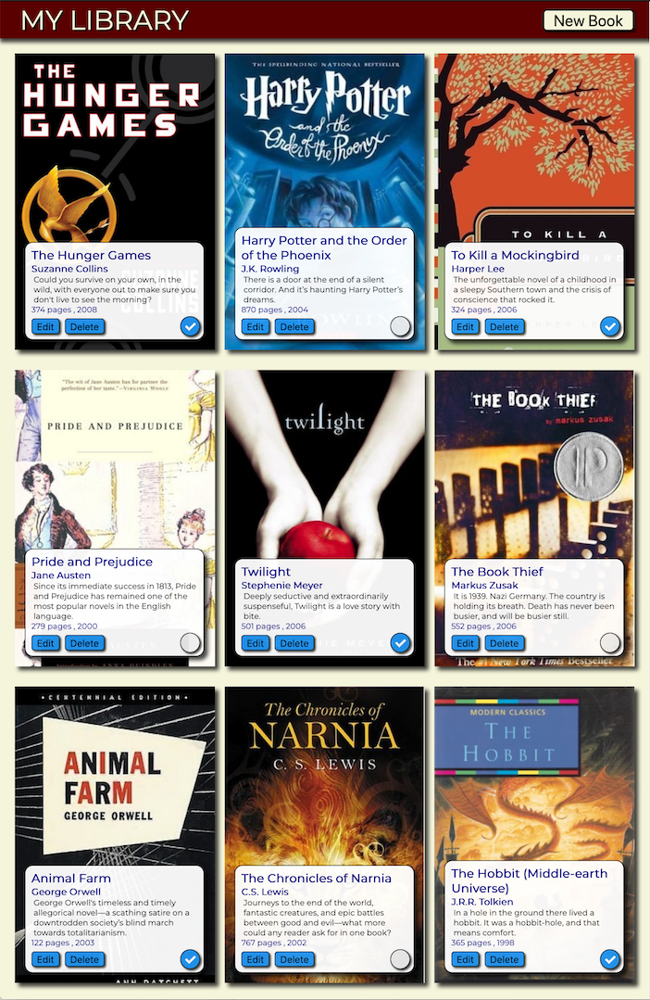

# Project: My Library

This is a neat little web app for keeping track of books you have read as part of an
[assignment](https://www.theodinproject.com/courses/javascript/lessons/library) for The Odin Project.
The books are arranged using Flexbox for the layout with space between justification.
The tricky part of using Flexbox is the odd looking gap it leaves behind on the last row.
This was solved by using a function calculate the number of empty squares need to fill the empty slots and then filling them in.

### [Visit My Library](https://winplam.github.io/library/)

The book info is stored in a JavaScript array and a modal overlay appears editing or adding a new book.
One challenge was making the read check box (circle) completely out of CSS and getting it to toggle between checked and unchecked states correctly.  

The images are book covers are background images and they are URL's that point directly to the cover images instead of being stored locally.
All the JavaScript functions were originally created using regular function syntax but refactored into classes as part of the assignment requirements. 

## Screenshot

## Technologies Used
This page was made with ES6 JavaScript, HTML 5 and CSS 3 using Webstorm for the IDE. 

## Wish List
* Original storage of date was done using local storage so changes were somewhat permanent.
This was changed to session storage so that the sample data can easily be reset with a refresh of the page.
A future upgrade would be to import the storage mechanism. Using Firebase would be a possibility.
* Button to clear list of books and reset to sample data
* Google, Facebook and email login so visitors of the site can have their reading list retrieved from what ever computer they are on.